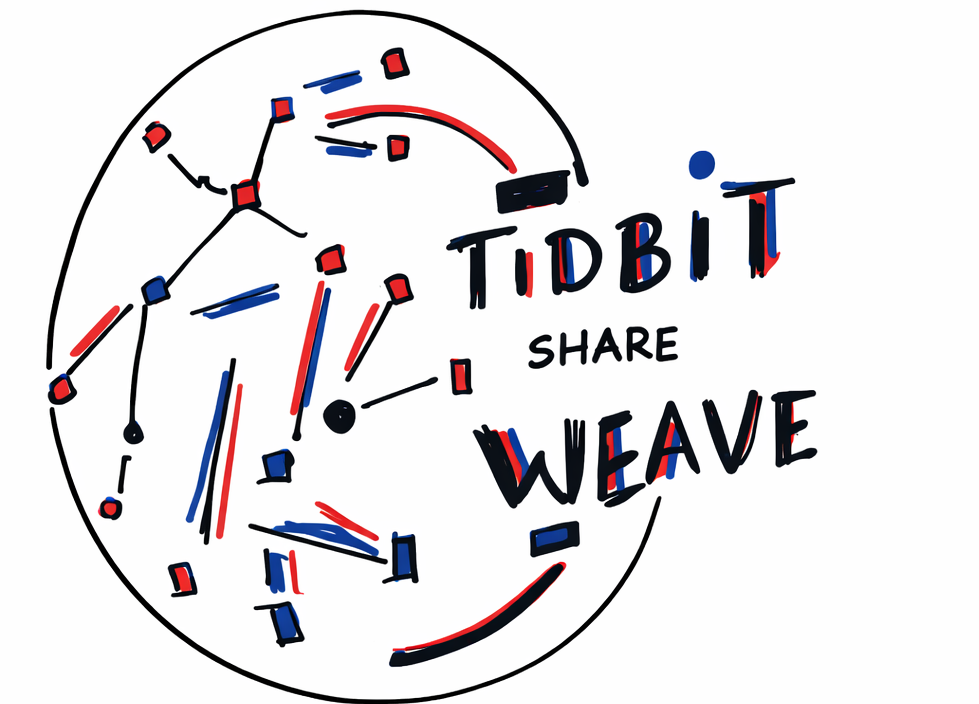

<p align="center">
  
</p>

<h1 align="center">TIDBIT-share-WEAVE</h1>

<p align="center">
  <strong>Quantum-Resistant · Zero-Trust · Wallet-Native File Custody</strong>
</p>

> A cryptographic constellation representing file lineage, custody, and trust without central authority.

## 🌐 TIDBIT-share-WEAVE

Quantum-Resistant, Zero-Trust File Custody & Sharing

Current production release line: `1.0.0`

TIDBIT-share-WEAVE is a decentralized, post-quantum-resilient file creation, versioning, review, signing, and sharing system designed for zero-trust environments, long-term data integrity, and wallet-native identity.

It provides cryptographically verifiable chain-of-custody for files, ensuring confidentiality, authenticity, and auditability even under future quantum threat models.

No central authority.
No silent mutation.
Every action is signed, linked, and traceable.

## 📚 Documentation

Project documentation now lives in:

- [Documentation Hub](./docs/README.md)
- [User Guide](./docs/user-guide.md)
- [Agent Workflows](./docs/agent-workflows.md)
- [Architecture](./docs/architecture.md)
- [Code Walkthrough](./docs/code-walkthrough.md)
- [Audit Folder](./audit/README.md)

## 🧠 What Makes TIDBIT-share-WEAVE Different

Unlike traditional file-sharing platforms, TIDBIT-share-WEAVE treats files as cryptographic entities, not just data blobs.

Each file:

- Is enveloped for tamper-evident custody
- Has an immutable event history
- Is owned and controlled via wallet identity
- Remains verifiable decades into the future

This makes it suitable for high-assurance environments where trust cannot be assumed.

## 🔐 Core Capabilities

### 🧬 Post-Quantum Cryptography (PQC)

- AES-256-GCM / XChaCha20-Poly1305 payload protection
- ML-KEM (Kyber) quantum-resistant key encapsulation
- ML-DSA post-quantum signatures via a maintained FIPS 204 implementation
- Browser-local ML-DSA signing in the web app via a bundled WASM signer
- SHA3-256 tamper-evident hashing

### 🧾 Zero-Trust Chain-of-Custody

- Every file action creates a signed, append-only event
- Immutable linkage between versions and actions
- Forensic-grade audit trails

### 👤 Wallet-Based Identity

- EVM and Solana wallets as identity roots
- No usernames or passwords
- Ownership and access tied to cryptographic proof
- Device-bound wallet sessions with session history and revoke controls

### 📂 Secure File Versioning

- Logical document separation
- Hash-based deduplication
- Verifiable version history with parent-child lineage

### 🌍 Decentralized Storage / Anchoring

- Supabase Storage for active application storage
- Optional Arweave-style anchoring for file and evidence hashes
- Infrastructure-independent verification

## 🧾 Chain-of-Custody Model

Every file interaction generates a cryptographically linked event containing:

- Actor identity
- Timestamp
- File hash
- Signature or attestation metadata
- Optional decentralized storage anchor

This forms a verifiable file-trail ledger suitable for:

- Compliance and audit
- Legal evidence
- Long-term archival
- Incident response and forensics

## 🧬 Design Philosophy

- Zero Trust by Default
- Post-Quantum First
- Wallets as Identity
- No Silent State Changes
- Verifiability Over Convenience

Trust is never implied. It is cryptographically proven.

## 🧪 Project Status

Current state includes:

- Wallet login for MetaMask and Phantom
- New-login revocation of older active wallet sessions
- Account session history with current, active, and revoked session visibility
- Secure file uploads
- Review-before-sign flow
- Public signing links
- Browser-native ML-DSA key generation, backup/import, and local PQ signing
- Document version creation
- Evidence export
- Inbox and share records
- Shared activity feed and sender/recipient audit coloring
- Wallet-to-wallet sharing across EVM and Solana
- Last-signed visibility on document cards and details
- Billing status scaffolding with 30-day trial metadata
- Optional Arweave anchoring
- Policy and agent API groundwork
- Clean Rust dependency audit at the current checkpoint

Still in progress:

- Browser-side PQ encryption, org-managed PQ custody, and crypto-agility
- Full production billing enforcement and checkout
- Office-class collaborative editing

## 🗺️ Roadmap

- End-to-end browser-side PQ encryption and managed-key lifecycle
- Provider-backed email and SMS delivery
- Wallet-native recipient notification and acceptance flows
- Human and AI agent policy routing
- Evidence bundle anchoring
- Subscription billing checkout and enforcement
- Production deployment

## 🔎 Security And Audit Progress

Recent dependency hardening work included:

- removing the broader `sqlx` umbrella dependency in favor of `sqlx-core` and `sqlx-postgres`
- replacing the previous PQ signing dependency with a maintained ML-DSA implementation
- re-running `cargo audit` until the Rust dependency graph was clean

Recent trust-model hardening work also included:

- durable wallet session and nonce storage in Postgres
- device-bound session checks via `x-device-id`
- rotation and explicit session revocation endpoints
- automatic revocation of older active sessions when the same wallet logs in again
- dashboard visibility into current, active, and revoked sessions

See the [Audit Folder](./audit/README.md) for the detailed history and current state.

## 🛡️ CI And Security Scanning

The repo now has two separate GitHub Actions security layers:

- `Secure Scan`
  Uses the external SecureCI workflow and publishes security alerts for the repository.
- `Validate`
  Runs repo-owned checks:
  - `cargo check`
  - `cargo audit`
  - `node --check backend-rs/web/app.js`

Recommended GitHub settings:

1. Require both `Secure Scan / secureci` and `Validate` in branch protection for `main`.
2. Keep direct pushes to `main` restricted once the workflow history is stable.
3. Review new security alerts before suppressing anything.

Branch protection itself must still be enabled in GitHub repository settings. It is not controlled by files in this repo.

## 🧬 Why This Exists

TIDBIT-share-WEAVE is built for a future where:

- Quantum computers are real
- Centralized trust collapses
- Data must remain verifiable for decades

This project is about cryptographic continuity, not just encryption.

## 📂 Project Structure

```text
TIDBIT-share-WEAVE/
├── backend-rs/
│   ├── Cargo.toml
│   ├── migrations/
│   ├── src/
│   │   ├── main.rs
│   │   ├── config.rs
│   │   ├── error.rs
│   │   ├── models.rs
│   │   ├── crypto/
│   │   ├── pqc/
│   │   ├── c2c/
│   │   ├── identity/
│   │   ├── routes/
│   │   ├── storage/
│   │   └── cli/
│   └── web/
├── docker/
├── image/
└── README.md
```

## 🔐 Security Architecture

### 🔒 Encryption Pipeline

```text
plaintext file
  ↓ envelope / payload protection
ciphertext + nonce
  ↓ ML-KEM wrapping
wrapped encryption keys
  ↓ canonical envelope
PQC-verifiable structure
  ↓ optional Arweave anchor
hash-anchored evidence
```

Everything is designed to be tamper-evident and verifiable. Some production flows are still evolving toward full browser-side zero-trust PQ execution.

Today, the web app already supports browser-local ML-DSA signing for review and public-envelope flows. The remaining PQ roadmap is about browser-side encryption, managed organizational custody, recovery, and crypto-agility.

## 🧪 Backend Setup

```bash
cd backend-rs
cargo build
cargo run -- server
```

Default local server:

```text
http://127.0.0.1:4100
```

Use `.env.example` as the environment template for:

- Supabase Postgres
- Supabase Storage
- PUBLIC_APP_URL
- Resend
- Twilio
- Billing trial / plan settings
- Stripe keys for future paid checkout
- Arweave / Bundlr-style anchoring

## 🚂 Railway Deployment

The repo is now set up for Railway using a root-level `Dockerfile` and `railway.json`.

Recommended Railway setup:

1. Create a new Railway project from the GitHub repo.
2. Let Railway detect the `Dockerfile`.
3. Set these required environment variables:
   - `DATABASE_URL`
   - `SUPABASE_URL`
   - `SUPABASE_SERVICE_ROLE_KEY`
   - `SUPABASE_BUCKET`
   - `PUBLIC_APP_URL`
4. Optional environment variables:
   - `RESEND_API_KEY`
   - `RESEND_FROM_EMAIL`
   - `TWILIO_ACCOUNT_SID`
   - `TWILIO_AUTH_TOKEN`
   - `TWILIO_FROM_NUMBER`
   - `ARWEAVE_API_KEY`
   - `ARWEAVE_ENDPOINT`
   - `ARWEAVE_AUTO_ANCHOR`
   - `BILLING_TRIAL_DAYS`
   - `BILLING_PLAN_USD`
   - `BILLING_ENFORCEMENT`

Production domain layout:

- `tidbitshare.com` → marketing landing page
- `app.tidbitshare.com` → authenticated app

Railway should be pointed at the GitHub repo deployment path, not a bucket/function model. This app needs a live Rust server, Supabase connectivity, and runtime auth/policy checks.

## CLI Examples

```bash
cargo run -- doc repair-storage-paths
cargo run -- c2c list
cargo run -- wallet show
```

## 🌌 Use Cases

- Secure document drafting
- Encrypted communication
- Multi-chain file transfer
- Legal, medical, and financial records
- Collaboration with provable custody
- Post-quantum secure archives
- Blockchain ecosystem file exchange
- Human and AI agent review flows

## ⚖️ License

MIT (subject to change)
