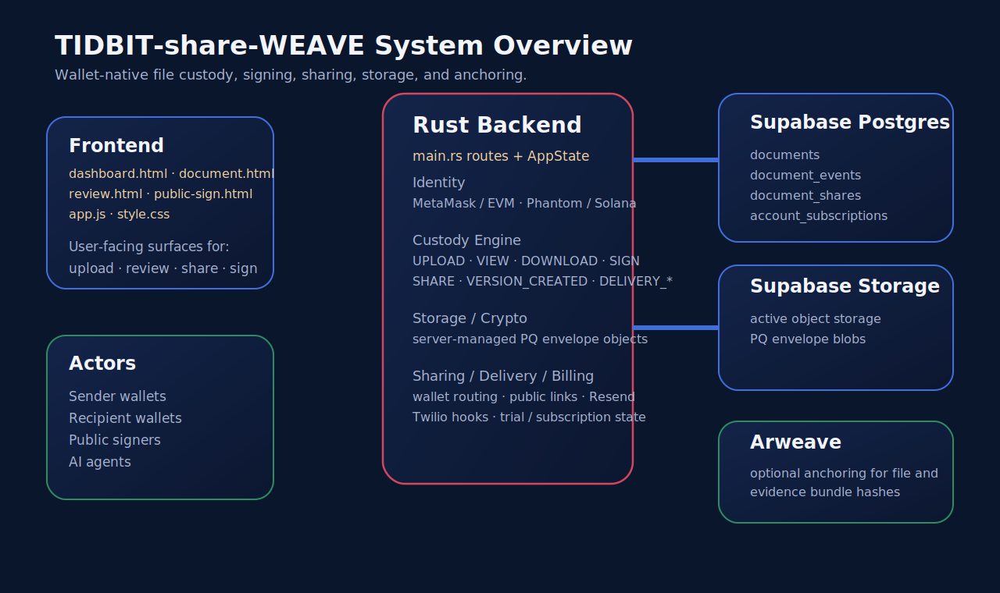
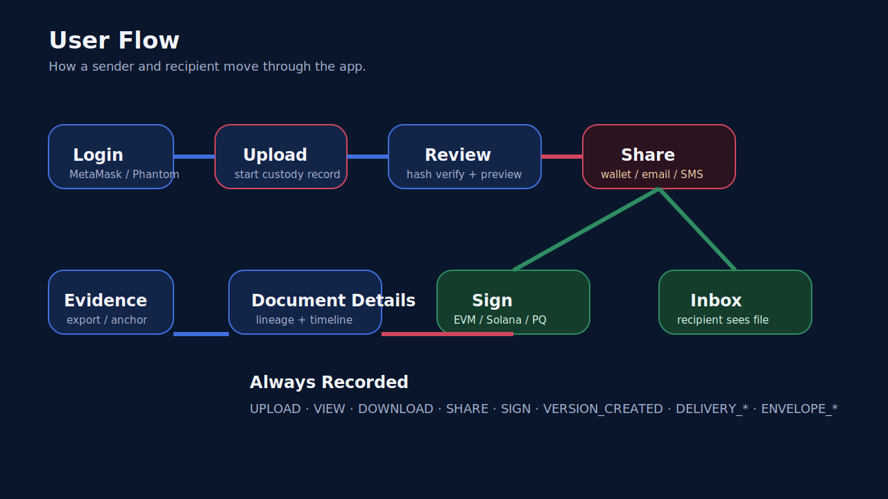

# TIDBIT-share-WEAVE Documentation

This documentation set explains what the app does, how the backend and frontend fit together, how users move through the product, and where the current security and dependency audit stands.

## Documentation Map

- [User Guide](./user-guide.md)
- [Review And Custody Concepts](./review-and-custody-concepts.md)
- [Architecture](./architecture.md)
- [Code Walkthrough](./code-walkthrough.md)
- [Security Audit Folder](../audit/README.md)

## Visual Overview

## What The App Is

TIDBIT-share-WEAVE is a wallet-native file custody and signing platform built around:

- static frontend pages in `backend-rs/web`
- a Rust backend in `backend-rs/src/main.rs`
- Supabase Postgres for metadata and custody events
- Supabase Storage for active encrypted object storage
- optional Arweave anchoring for evidence and file hashes
- EVM and Solana wallet identity
- public signing links and agent-oriented APIs

## How To Read These Docs

If you are new to the project:

1. Start with the [User Guide](./user-guide.md) to understand the screens and flows.
2. Read [Review And Custody Concepts](./review-and-custody-concepts.md) to understand why review, signing, versioning, and custody are treated as separate concepts.
3. Read [Architecture](./architecture.md) to understand how the browser, backend, Supabase, and Arweave fit together.
4. Read [Code Walkthrough](./code-walkthrough.md) to understand how the implementation is organized.
5. Read the [Security Audit Folder](../audit/README.md) to understand dependency and audit history.

## Current Product Surface

The app currently supports:

- MetaMask and Phantom login
- upload, review, download, sign, delete, and share
- public signing links
- wallet-to-wallet sharing
- shared inbox and shared activity feed
- evidence export
- linked document versions
- optional Arweave anchoring
- delivery provider integration points for Resend and Twilio
- billing status scaffolding for a 30-day trial and `$8/month` plan

## Current Security Position

The app has a real custody ledger and real signature verification, but there are still important boundaries:

- Supabase object storage is active application storage
- the current web path uses server-managed PQ envelope storage, not browser-generated PQ encryption yet
- signatures are cryptographically verified by the app, but they are not on-chain attestations by default
- billing status exists, but Stripe checkout and hard billing enforcement are not finished yet

## Current Audit Position

As of the current March 2026 audit pass:

- Rust dependency audit: clean
- prior `sqlx` umbrella dependency issue: mitigated
- prior unmaintained PQ signing dependency issue: mitigated

The audit details and remediation path are documented in the [Audit Folder](../audit/README.md).

## CI Position

The repo now uses:

- SecureCI for repository security scanning and alert publication
- a repo-owned validation workflow for Rust and frontend syntax checks

For production discipline, these workflows should be required in GitHub branch protection.

## Recommended Reading Order

1. Read the [User Guide](./user-guide.md) to understand the product from the user side.
2. Read the [Architecture](./architecture.md) to understand the data flow and security model.
3. Read the [Code Walkthrough](./code-walkthrough.md) to understand how the code is organized.
4. Read the [Audit Folder](../audit/README.md) to review dependencies and the current Rust audit status.
