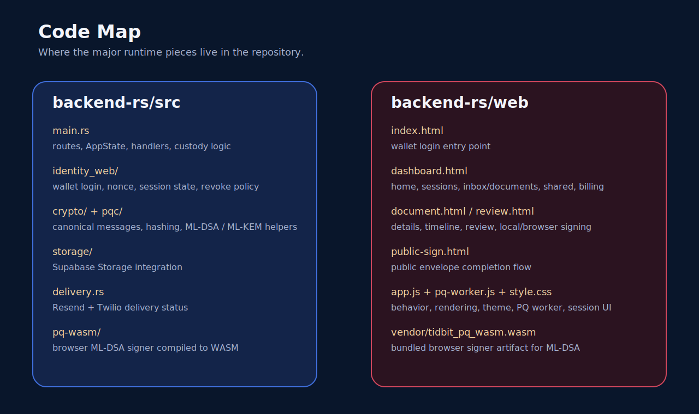

# Code Walkthrough

## Core Runtime

### `backend-rs/src/main.rs`

This is the application entrypoint and route host.

It is responsible for:

- constructing `AppState`
- connecting to Supabase Postgres
- creating the Supabase Storage client
- ensuring runtime schema safety checks
- mounting all major HTTP routes

Important route groups:

- wallet auth
- document CRUD and review
- share and inbox routes
- evidence export and anchoring
- agent routes
- public signing routes
- billing/account status

## Key Backend Areas

### Identity

Folders:

- `backend-rs/src/identity`
- `backend-rs/src/identity_web`

What they do:

- hold wallet session logic
- issue nonces
- bind wallet sessions
- verify EVM and Solana login flows

### Crypto

Folders:

- `backend-rs/src/crypto`
- `backend-rs/src/crypto/canonical`
- `backend-rs/src/pqc`

What they do:

- canonical message building
- envelope building
- hashing
- PQ signature verification helpers
- key wrapping helpers

### Storage

Folder:

- `backend-rs/src/storage`

What it does:

- uploads and retrieves object blobs from Supabase Storage
- handles storage paths and object lifecycle helpers

### Delivery

File:

- `backend-rs/src/delivery.rs`

What it does:

- Resend email calls
- Twilio SMS calls
- delivery outcome struct and provider result normalization

### Frontend Runtime

Files:

- `backend-rs/web/app.js`
- `backend-rs/web/style.css`

What they do:

- login handling
- page bootstrapping
- dashboard tab state
- upload/share/sign/download flows
- inbox and shared activity rendering
- billing status rendering
- custody timeline rendering

## Important Functions To Understand

### `create_document_record`

Purpose:

- create a new stored document record
- generate the server-managed PQ envelope
- upload the envelope blob
- insert metadata into `documents`

### `load_document_access_record`

Purpose:

- decide whether the current actor can access a document
- support owner access and chain-aware share access

This is one of the most important trust boundaries in the app.

### `share_doc_handler`

Purpose:

- create the share row
- determine wallet route vs provider route
- create the public token/signing URL
- write custody events

### `sign_doc_handler`

Purpose:

- verify a canonical signature
- accept EVM, Solana, and PQ verification paths
- write a `SIGN` event to the custody ledger

### `public_envelope_sign_handler`

Purpose:

- support public signing links
- allow guest, EVM, Solana, or PQ completion flow
- mark envelope completion and record event history

## Frontend Page Responsibilities

### `dashboard.html`

Main workspace entry point with:

- home stats
- inbox/documents
- shared files
- shared activity
- billing

### `document.html`

Single-document control surface with:

- metadata
- preview
- lineage
- share state
- custody timeline

### `review.html`

Focused review-before-sign page.

### `public-sign.html`

Unauthenticated or public token signing page.

## How The Tool Is Made

The tool is not a single blockchain app and not a single storage app. It is a layered system:

1. **Wallet identity layer**
   MetaMask and Phantom identify users.
2. **Application custody layer**
   Every important action becomes a ledger event in Postgres.
3. **Object storage layer**
   Supabase stores the live encrypted object.
4. **Verification layer**
   Hashes and signatures verify what happened.
5. **Anchoring layer**
   Arweave can anchor evidence externally.

That layered approach is why the app can behave like a document-signing product while still preserving cryptographic custody and future decentralization options.

## Current Engineering Gaps

These are the main code-level areas still worth improving:

- split `main.rs` into route modules and service layers
- tighten or remove currently unused legacy modules
- finish billing checkout and enforcement
- finish browser-side PQ path
- add stronger integration tests around shared activity and delivery
