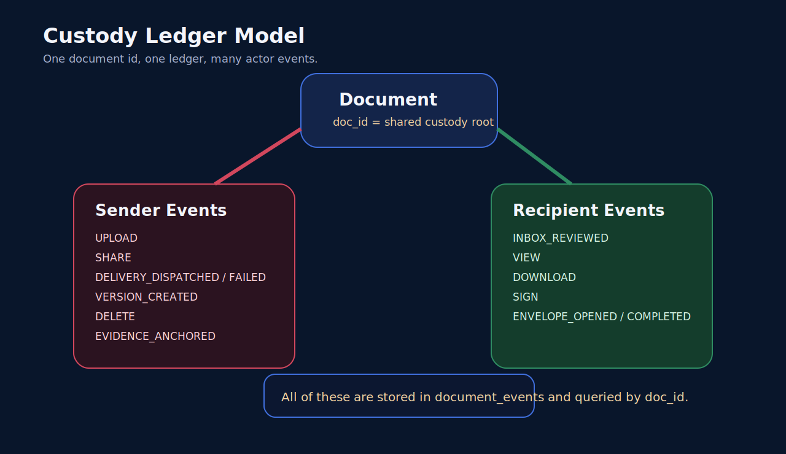

# Review And Custody Concepts

This document explains the product ideas that matter most in TIDBIT-share-WEAVE:

- what "review" means
- what "sign" means
- what chain of custody means
- why versioning matters
- how shared workspaces behave
- where cryptography fits

## Core Idea

TIDBIT-share-WEAVE is not designed like a normal file-sharing app where a document is just a blob sitting in storage.

In this app, a document is treated as:

- a file object
- a cryptographic hash
- a custody record
- a version lineage
- an access history
- an optional anchored evidence object

That is why the platform separates actions that many ordinary apps collapse together.

## Review Is Not The Same As Signing

Review means:

- the user opened the document
- the user had a chance to inspect the content
- the app can log that the document was seen
- the app can compare the file preview hash against the stored custody hash

Signing means:

- the user approved or attested to the document
- the user produced a cryptographic proof
- the backend verified that proof against the canonical signing message
- the ledger recorded the signing event

This distinction matters because a high-assurance signing system should be able to answer separate questions:

- Was the document ever opened?
- Who reviewed it?
- Who signed it?
- Which exact version was signed?
- Did the signer use EVM, Solana, guest attestation, or ML-DSA?

## What "Review" Means In Practice

In the current app, a review flow usually includes:

1. loading document metadata from Postgres
2. verifying access rights
3. loading the stored object through backend-controlled blob routes
4. checking the current content against the stored custody hash
5. rendering a preview
6. logging a custody event such as `VIEW` or inbox-related review activity

The goal is not just convenience. The goal is to make review itself auditable.

## What A Canonical Signing Message Is

The app does not sign an arbitrary UI label.

It builds a canonical message that includes important facts such as:

- document id
- hash
- action
- wallet or signer identity
- version

That matters because signature verification should be tied to the exact document state being approved, not just to a generic message like "I approve this file."

## Chain Of Custody

Chain of custody means the system can reconstruct the history of a file in a way that is useful for:

- compliance
- disputes
- investigations
- evidence export
- long-term verification

In this app, that means a single document should accumulate events like:

- `UPLOAD`
- `VIEW`
- `DOWNLOAD`
- `SHARE`
- `DELIVERY_DISPATCHED`
- `DELIVERY_FAILED`
- `SIGN`
- `VERSION_CREATED`
- `DELETE`
- `INBOX_REVIEWED`
- `INBOX_SIGNED`
- `ENVELOPE_OPENED`
- `ENVELOPE_COMPLETED`

Each event can carry more than a label. It can also carry:

- actor identity
- actor chain
- request metadata
- timestamps
- signing metadata
- note fields
- version references
- delivery metadata

## Why Versioning Matters

Versioning is part of custody, not a side feature.

If a document changes, the system should preserve:

- the old state
- the new state
- the parent-child link between versions
- the version number
- the hash of each version
- the custody events tied to each version

Without that, a later signed document can be confused with an earlier unsigned one.

That is why the app creates linked versions and records `VERSION_CREATED` instead of silently overwriting document state.

## Shared Workspace Model

The current product behaves like a shared workspace built around document visibility, not around a fully separate organization data model.

That means:

- the sender and recipients interact with the same underlying document ledger by `doc_id`
- wallet-routed recipients can see shared files in their inbox
- sender and recipient actions can appear in shared activity
- the per-document custody timeline remains the source of truth

This is important because it means recipient activity is not a side log. It is part of the same custody record for the same file.

## Actor Types

The product is built around first-class actors.

Examples:

- human wallet actors
- public or guest signers
- delivery/system actors
- AI agents

This matters because a real audit system should answer:

- was this action taken by a sender or recipient?
- was it taken by a wallet, a guest link, or an automated system?
- did an AI agent only review, or did it also propose an edit or sign?

## Cryptography Layers

The tool uses multiple cryptographic layers for different jobs.

### Hashing

Hashes are used to:

- identify exact file content
- verify previews and downloads
- connect evidence to specific bytes

### Wallet Signatures

Wallet signatures are used for:

- user identity
- human approval
- non-repudiation of signing actions

### ML-KEM Envelope Storage

ML-KEM is used for the envelope and key-wrapping side of the storage model.

That is part of the app's zero-trust and post-quantum direction.

### ML-DSA Signatures

ML-DSA is the maintained post-quantum signing path in the codebase.

That is different from EVM and Solana signatures:

- EVM and Solana are practical wallet flows
- ML-DSA is the post-quantum signature path

In the current web application, ML-DSA is no longer just a manual proof format. Review and public-envelope flows can now generate and use the ML-DSA key locally inside the browser, then send the public key and signature proof to the backend for verification and evidence recording.

## Where Arweave Fits

Arweave is not the primary live file store.

Supabase Storage holds the active file object used by the application. Arweave is used as an optional external anchor for:

- file evidence
- evidence bundle references
- immutable external attestations

That means the app can keep fast application storage while still building a long-term anchoring story.

## What Reviewers Should Check

If you are reviewing the system, the most important things to verify are:

1. Access control: only owners or valid recipients can fetch file content.
2. Signature verification: signing must verify against canonical messages, not arbitrary strings.
3. Version lineage: new versions must link to parents and keep separate hashes.
4. Event integrity: important actions must create custody records.
5. Delivery clarity: wallet routing and provider delivery must not be confused.
6. Evidence continuity: exported evidence should match what is in the document ledger.

## Current Boundaries

The product is materially stronger than a basic share-and-sign app, but these boundaries still matter:

- browser-local PQ signing is available, but browser-side PQ encryption is not yet the default web path
- Arweave anchoring is optional
- on-chain attestation is not the default signature model
- billing and provider delivery are not fully production-complete
- Office-class collaborative editing is still a roadmap item

## Why This Matters

A conventional document app mostly answers:

- where is the file?
- who can access it?

TIDBIT-share-WEAVE is trying to answer harder questions:

- what exact file was approved?
- who reviewed it before approval?
- what changed between versions?
- when did the change happen?
- how can a third party verify that history later?

That is the reason the product treats review, signing, sharing, versioning, and evidence as connected but distinct concepts.
